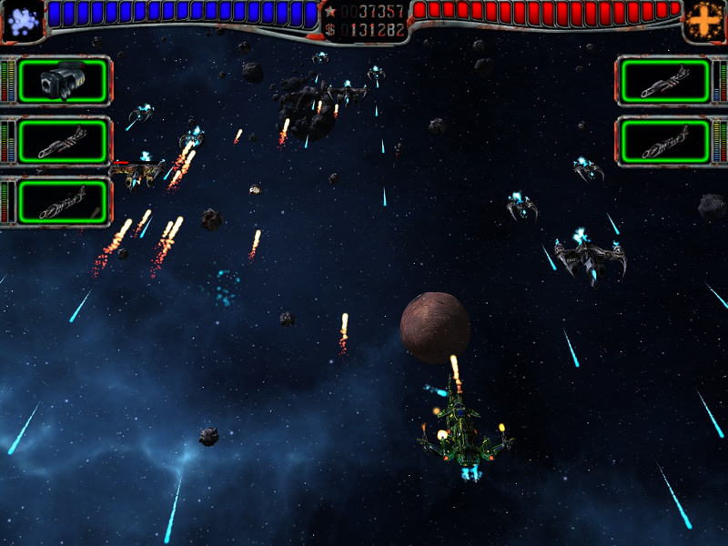
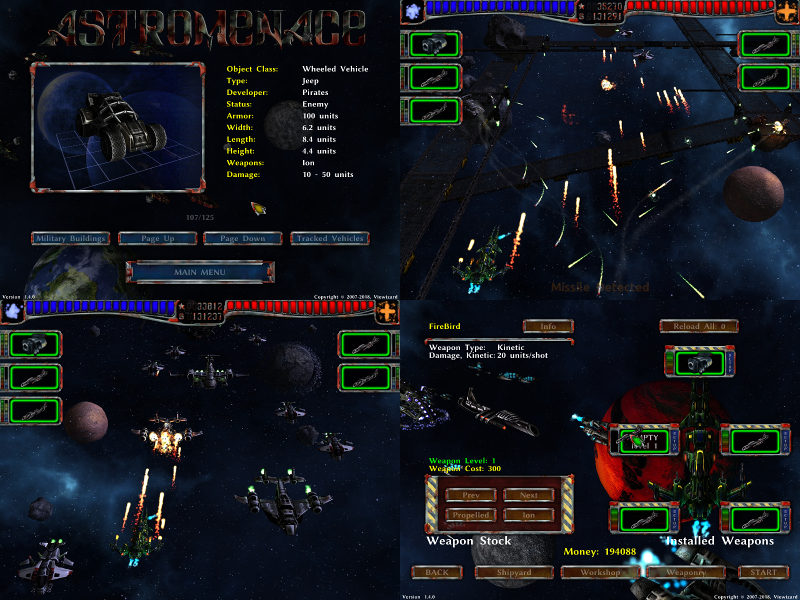
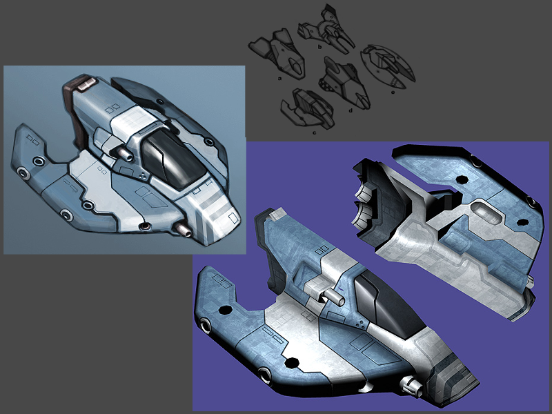
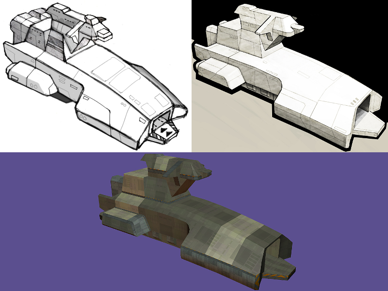

# AstroMenace  [](https://travis-ci.org/viewizard/astromenace) [](https://discord.gg/PMqWxVX)

* [Installation (Windows, macOS, Linux)](https://github.com/viewizard/astromenace#installation)
* [Build (macOS, Linux)](https://github.com/viewizard/astromenace#build)
* [Translators Wanted](https://github.com/viewizard/astromenace#translators-wanted)
* [Work In Progress](https://github.com/viewizard/astromenace#work-in-progress)
* [Donate to Support Development](https://github.com/viewizard/astromenace#donate-to-support-development)  [](https://github.com/viewizard/astromenace#bitcoin-14kdalnntroffuur2tzmudup8ek3ps2uq6)  [](https://github.com/viewizard/astromenace#paypal-httpswwwpaypalmeviewizard)  [](https://github.com/viewizard/astromenace#patreon-httpswwwpatreoncomviewizard)

---

[AstroMenace on YouTube, a video is worth a thousand words.](https://www.youtube.com/watch?v=ysY9vKKisbo&index=1&list=PLrWi_GXhwHyznYT19oAQL4zNldlVXFlj2)

Immerse into a decisive battle against tons of cunning foes, face the terrifying bosses and protect your homeland throughout 15 diverse levels of the game. The hardcore gameplay of AstroMenace, packed with pure non-stop action, will become a full scale test for your basic instinct of survival.

<p align="center">
  
</p>

The game provides a wide variety of armaments and weapon upgrades for discharging the retributive wrath upon the hordes of enemies, besides it has a great number of improvements for enhancing the defensive abilities of your spaceship. Collect money during the combat and invest them into turning your spaceship into an ultimate weapon of mass destruction.

<p align="center">
  
</p>

More information and screenshots could be found at [AstroMenace website](https://www.viewizard.com/).

## Installation

Installer for Windows and macOS bundle could be found at [release](https://github.com/viewizard/astromenace/releases) section.

Almost all popular Linux distros already have a stable version of the game in their repositories. Install the "astromenace" package with your distro's package manager. We do not provide compiled binary packages for Linux anymore, contact maintainers of your Linux distro in order to get binary package.

[](https://repology.org/metapackage/astromenace)
[](https://repology.org/metapackage/astromenace)

#### Debian/Ubuntu and derivatives
```
sudo apt-get install astromenace
```

#### OpenSuse
```
sudo zypper install astromenace
```

#### Fedora
```
sudo yum install astromenace
```

#### Gentoo
```
sudo emerge openastromenace
```

## Build

Build dependencies:
libSDL2 (ver 2.0.5+), libopenal (ver 1.0+), libalut (ver 1.0+), libogg (ver 1.1+), libvorbis (ver 1.1+), freetype (ver 2.1.6+)


The easy way to get up to date AstroMenace on your computer:

### 1) Make sure all necessary packages with development headers installed in your system: 

gcc or clang, cmake, make, git, libsdl2, libogg, libvorbis, openal, alut (freealut), freetype2

#### For macOS:
Download and install "Command Line Tools for Xcode" or "Xcode".
Install HomeBrew package manager: https://brew.sh/
```
$ brew install cmake sdl2 git libogg libvorbis freealut freetype
```

#### For Ubuntu/Mint/Debian:
```
$ sudo apt-get install g++ cmake make git libsdl2-dev libogg-dev \
  libvorbis-dev libopenal-dev libalut-dev libfreetype6-dev
```

#### For Mageia:
```
$ sudo urpmi gcc-c++ cmake make git libsdl2.0-devel libogg-devel \
  libvorbis-devel libopenal-devel libfreealut-devel freetype2-devel
```

#### For OpenSuse:
```
$ sudo zypper install gcc-c++ cmake make git libSDL2-devel libogg-devel \
  libvorbis-devel openal-soft-devel freealut-devel freetype2-devel
```

#### For Fedora:
```
$ sudo yum install gcc-c++ cmake make git SDL2-devel libogg-devel libvorbis-devel \
  openal-soft-devel freealut-devel freetype-devel linux-libertine-fonts
```

#### For FreeBSD:
```
$ sudo pkg_add -r -v gcc cmake git sdl20 libogg libvorbis openal freealut freetype2
```

### 2) Clone git with latest source files
```
$ cd ~/
```
```
$ git clone https://github.com/viewizard/astromenace.git astromenace
```

### 3) Compile game binary (game data file will be created automatically)
```
$ cd ~/astromenace
```
```
$ cmake ./
```
```
$ make
```

### 4) Create desktop shortcut or start AstroMenace
```
$ ~/astromenace/astromenace
```

## Translators Wanted
Please help us make AstroMenace more friendly and clear for all gamers.

AstroMenace localization now supported by Crowdin https://crowdin.com/project/astromenace.

Don't hesitate to create [issue](https://github.com/viewizard/astromenace/issues), if you have questions or you need help.

## Work In Progress
Yes, AstroMenace was first released in 2007, but work still in progress. For open source game, no need to change game's title in order to evolve.

The main goal now is code refactoring for modern OpenGL features and new C++ standards (C++11, STL). Plus, I still provide AstroMenace code support, that means changes for new libs versions and new compilers versions.

Unfortunately, I could not provide you with any new version's release dates, since this is extremely depends from my free time and limited resources. Check project's [plans](https://github.com/viewizard/astromenace/projects) for more info about current progress.

We also have a surprise for you, here is the artwork 1 of 12 light ships and 1 of 8 capital ships we already have, with best wishes from Oleg Linkov (3D models author). Since this is ours 3D models, we will release sources under GPLv3 in [astromenace-artwork](https://github.com/viewizard/astromenace-artwork) repository as soon, as AstroMenace will use them. I hope, some day we will replace all 3D models licensed under CC-BY-SA (without sources) to open source 3D models.
<p align="center">
  
</p>
<p align="center">
  
</p>

## Donate to Support Development
#### Bitcoin: 14kDaLnNTroFfuur2tZmUdUp8eK3pS2Uq6
<p align="left">
  
</p>

#### PayPal: https://www.paypal.me/viewizard

#### Patreon: https://www.patreon.com/viewizard

#### Bank Transfer
* All donations are anonymous. Any sender details are not published or shared.
* A tax-related donation receipt can not be issued because Viewizard is not a commercial nor registered organization.
* Legally, it is a private donation.

##### On the transfer form, «Donation» or «Financial assistance» must be mentioned in the purpose area.
```
Beneficiary’s bank             ALFA-BANK
Beneficiary’s bank address     27 Kalanchevskaya str., Moscow, 107078
S.W.I.F.T.                     ALFARUMM
Beneficiary’s Acc. №           40817840506220005728
Beneficiary                    Kurinnoi Mikhail Georgievich

Correspondent bank of beneficiary’s bank
CITIBANK NA
399 Park Avenue, New York, NY 10043, USA
CITIUS33
Acc. With corresp Bank № 36310481
```
